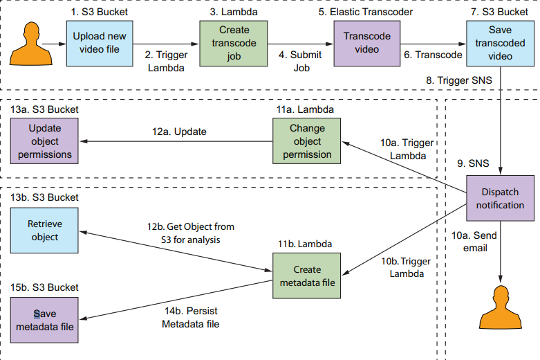

# SERVERLESS AWS LAMBDA VIDEO TRANSCODER

## An event-driven pipeline that takes uploaded videos and encode them to different formats and bitrates. 
  
## An event-driven, push-based system where the workflow(lambdas) to encode videos will be triggered automatically by an upload to an S3 bucket.

# ARCHITECTURE 

